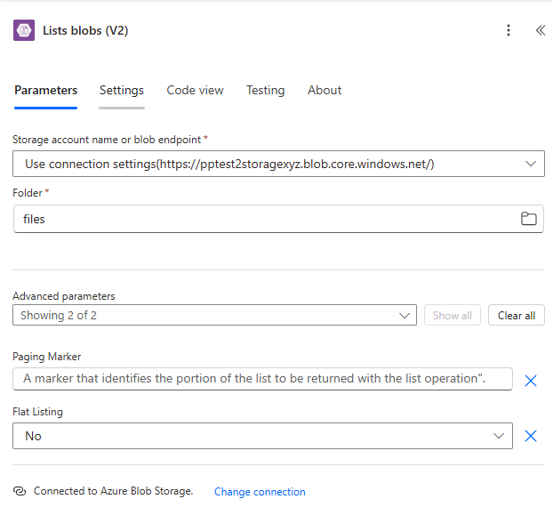

# Power Platform Azure VNet Samples and Demo

This repo contains templates, scripts and guides to help you set up and test a Power Platform environment with Azure VNet integration. Most of the contenet in the repo is based on the Microsoft documentation and samples, but it's not always easy to find and I have added some additional information and examples to help you get started.

The can find the  Microsoft documentation for Azure VNet integration with Power Platform [here](https://learn.microsoft.com/en-in/power-platform/admin/vnet-support-overview).

Before you start, please note that this is a demo and not a production ready solution. The templates and scripts are provided as-is and should be used at your own risk. I've also assumed that you have good knowledge of Azure, Power Platform and PowerShell - there are quite a few steps to get everything set up and running and I haven't provided detailed instructions for each step.

The demo contains the following sections - you can choose to use all or some of them:

* Bicep template and a guide to create Azure resources (inlcuding VNets) and link them to a Power Platform environment - if you complete this step you will be able to use private Azure resources in your Power Platform environment and call them from Power Apps and Power Automate flows.
* Samples for the Power Platform connectors that support connectivity to resources in an Azure VNet. You can use these samples after you have set up the Azure resource contained in this demo, or you can modify them to use your own Azure resources. Demos of the following connectors are included:
  * Azure Blob Storage 
  * Custom Connectors - connecting to your custom APIs
  * HTTP with Microsoft Entra ID (preauthorized) - connecting to your custom APIs with Entra ID authentication 

### Prerequisites: 

Azure CLI
Power Platform Admin Access
Entra ID Application Manager Access (if using Entra ID authentication)

## Creating Azure Resources and Conecting to Power Platform

To set up a demo environment with Power Platform Azure VNet integration, you will need to complete the following steps:
1. Set up your local PowerShell environment with the required modules, and you Azure subscription with the required features and providers. This can be done manually or using PowerShell scripts provided in this repo.
1. Create the required Azure resources using the Bicep template provided in this repo
1. Connect your Power Platform environment to the Azure VNet using PowerShell

These steps are described in the [Microsoft documentation](https://learn.microsoft.com/en-in/power-platform/admin/vnet-support-setup-configure), but I have simplified the process by providing a Bicep templates to create the required Azure resources.

### 1. Set up your local PowerShell environment with the required modules

Management of the connection from Power Platform to an Azure VNet is done using PowerShell. Before you can run the PowerShell scripts, you need to set up your local PowerShell environment and you Azure subscription with the required modules and services. Two scripts are [provided by Microsoft](https://github.com/microsoft/PowerApps-Samples/blob/master/powershell/enterprisePolicies/README.md#how-to-run-setup-scripts) to help you with this process, and these have been included in the `scripts` folder of this repo. The scripts are:

* `SetupSubscriptionForPowerPlatform.ps1` - registers the Azure subscription for Microsoft.PowerPlatform resource provider and also allow lists the subscription for enterprisePoliciesPreview feature. Alternatively you can register the required providers and features with the following Azure CLI commands:
```
az provider register --namespace Microsoft.PowerPlatform
az feature register --name enterprisePoliciesPreview --namespace Microsoft.PowerPlatform
```
* ` InstallPowerAppsCmdlets.ps1` - installs the required modules to run Enterprise Policies scripts. Alternatively you can manually install the following PowerShell modules:
```powershell
Az
Microsoft.PowerApps.Administration.PowerShell
Microsoft.PowerApps.PowerShell
```

### 2. Create the required Azure resources using the Bicep template provided in this repo

Clone this repo to your local machine and open repo in Visual Studio Code. From a teminal window, run the following command from the `infra` directory to create the Azure resources:

``` powershell
$rg = "<your resource group name>"
$name = "<base name for your resources>"
az deployment group create --resource-group $rg --template-file ./main.bicep --parameters --name $name
``` 

This script will create the following resources in your Azure subscription:

* Two Azure VNets, one in each of the regions association with the Power Platform environment. The default regions are `eastus` and `westus` for Power Plaform envrionments in the United States.  If your Power Plaform environment is in a different region see the [supported region list](https://learn.microsoft.com/en-in/power-platform/admin/vnet-support-overview#supported-regions) and update the `pimaryLocation` and `secondaryLocation` parameters in the Bicep template appropriately. Note that the template currently doesn't support Power Platform regions with a single associated Azure region. The created VNets are peered.
* A subnet in each VNet delegated to Power Platform. The subnets are named `powerplatform` and are delegated to `Microsoft.PowerPlatform/enterprisePolicies`
* A `NetworkInjection` Enterprise Policy - this policy is required to connect the Power Platform environment to the Azure VNets. Note that actual connection is performed in a later step.
* An Azure Storage account in the primary region, with a private endpoint in the primary VNet. The storage account is configured with a private DNS zone, and public access is disabled. A single blob container named `files` is added to the storage account.
* Two Azure Container Apps in a Container Apps environment in the primary region. The Container Apps Environment is deployed into the primary Vnet with external ingress allowed from the VNet only. Each container app hosts a simple API that responds to a `/api/ping` request, and one of the container apps is protected with Entra ID authentication. 

The Storage account and Container Apps are deployed using separate Bicep modules - if you don't need these resources you can comment them out in the main Bicep template.

The Bicep template writes a number of values to the outputs collection - these values are required if you are also going to set up a custom conenctor to call the APIs, or if you are going to call the protected API using Entra ID authentication. The values are:

`policyArmId` - the resource ID of the `NetworkInjection` Enterprise Policy. This is required to connect the Power Platform environment to the Azure VNet.
`containerAppNoauthFQDN` - the FQDN of the unprotected Container App. This is required to set up a custom connector to call the API.
`containerAppauthFQDN` - the FQDN of the protected Container App. This is required to set up the HTTP with Microsoft Entra ID (preauthorized) connector to call the API.
`containerAppAuthAppId` - the application ID of the Entra ID app registration used to protect the Container App. This is required to set up the HTTP with Microsoft Entra ID (preauthorized) connector to call the API.
`blobServiceEndpoint` - the blob service endpoint of the storage account. This is required to set up a Blob Storage connector

### 3. Connect your Power Platform environment to the Azure VNet using PowerShell

To connect your Power Plaform environment you will need to run the `NewSubnetInjection.ps1` script (the original is [here](https://github.com/microsoft/PowerApps-Samples/tree/master/powershell/enterprisePolicies#7-set-subnet-injection-for-an-environment), can also be found in the `scripts` folder in this repo). This script takes the following parameters:

* `-environmentId` - the ID of the Power Platform environment to connect to the Azure VNet. This can be found in the Power Platform admin center. Note this is not the name of the environment, but the GUID that is used to identify the environment in Azure (e.g. `Default-cf7a4a08-6d30-40c8-bd52-d6f7494c0541`)
* `-policyArmId` - the resource ID of the `NetworkInjection` Enterprise Policy created be the bicep templates in the previous. This can be found by looking for the value of the `policyArmId` output from the Bicep template, or by looking in the Azure portal for the `NetworkInjection` policy in your resource group. The resource ID will look something like this: `/subscriptions/<subscriptionId>/resourceGroups/<rgName>/providers/Microsoft.PowerPlatform/enterprisePolicies/<policyName>`

To check if the environment was successfully connected to the Azure VNet you need to check the Power Platform admin center. Navigate to `Manage > Environments > <your environment>`, and check the recent operations list - you should see an operation of type `New Network Injection Policy` with a status of `Succeeded`. 

To remove the connection to the Azure VNet you can use the `RevertSubnetInjection.ps1` script. This script takes the same parameters as the `NewSubnetInjection.ps1` script, and will remove the connection to the Azure VNet.

## Samples for Testing the Virtual Network Connection

### Azure Blob Storage

The simplest way to test the connection to the Azure VNet is to use the Azure Blob Storage connector. This connector supports connectivity to resources in an Azure VNet, and can be used to read, write and list files to the Azure Storage account created by the Bicep template. Because public connectivity to this storage account account is disabled, any succssful operation using the Azure Blob Storage connector will confirm that the connection to the Azure VNet is working.

* Create a new Power Automate flow in your Power Platform environment 
* Add the `List blobs (V2)` action, and use the key from the Storage account to create a connection.
* In the "Storage account or blob endpoint" field you will need to enter the FQDN of the storage account. This value is output by the Bicep template, and is the name of the storage account followed by `.blob.core.windows.net` (e.g. `mystorageaccount.blob.core.windows.net`). 
* Select "files" as the folder. It doesn't matter if there are no files in the folder, we are just testing the connection

The properties of the action should look something like this:



Run the flow and check the output of the `List blobs (V2)` action. If the connection to the Azure VNet is working, you should see a list of blobs in the output.

### Custom Connectors - connecting to your custom APIs

Add paramaters to custom connectors:

https://philcole.org/post/environment-specific-custom-connector-endpoints/

1. Create custom connector

### HTTP with Microsoft Entra ID (preauthorized) - connecting to your custom APIs with Entra ID authentication 

Using Entra ID (preauth):

https://www.blimped.nl/calling-entra-id-secured-azure-function-from-power-automate/

@pnp/cli-microsoft365
Add authorized client app to Azure AD (Expose an API, Authorized client applications)

1. Update Entra ID app registration (powershell)
1. Add Authorized client app to Azure AD (powershell)([Update AAD app API settings](https://learn.microsoft.com/en-us/powershell/module/az.resources/update-azadapplication?view=azps-13.4.0#-api))


Note: to make the draw.io diagrams render properly in dark mode on GH add `color-scheme: light dark` to the SVG style - this will be overritten if you modify the file in draw.io

